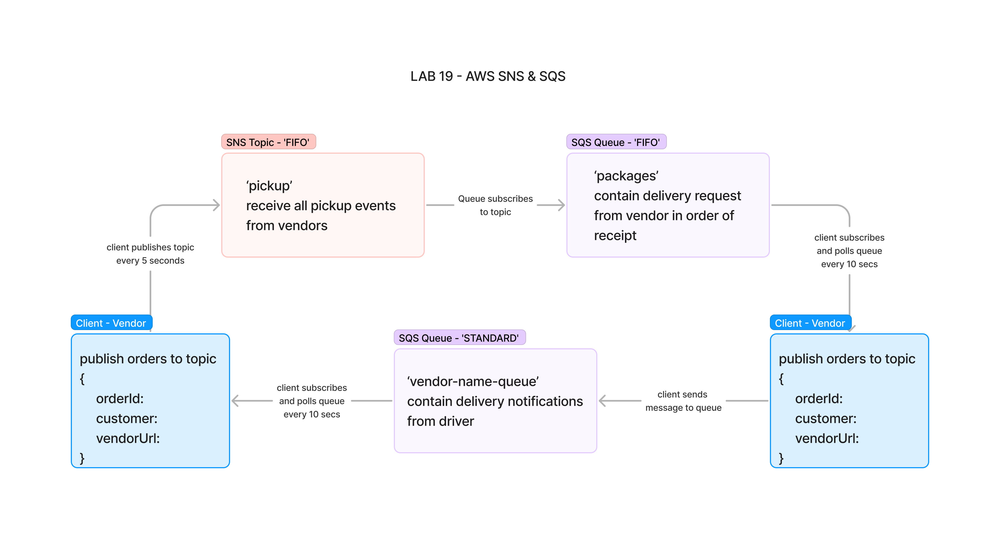
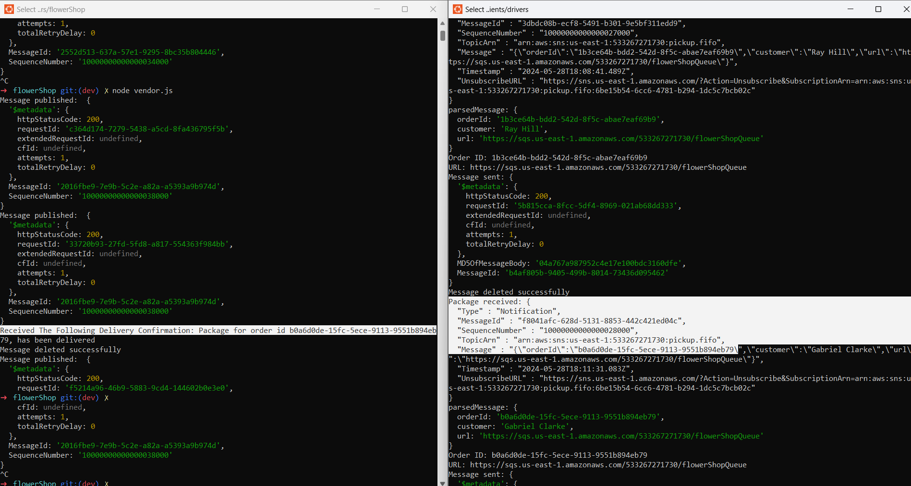

# 401 - Lab 19 - AWS: Events  

## Project: Create a cloud version of the CAPS system

### Author: Melo

### Problem Domain

Using only AWS Services: SQS, SNS, and client applications, create a cloud version of the CAPS system

### Feature Tasks & Requirements

* **Required Services**

    1. SNS Topic (FIFO): pickup which will receive all pickup requests from vendors.
    2. SQS Queue (FIFO): packages which will contain all delivery requests from vendors, in order of receipt.
    Subscribe this queue to the pickup topic so all pickups are ordered.
    3. SQS Queue (Standard) for each vendor (named for the vendor) which will contain all delivery notifications from the drivers.

* **Operations**  
**Vendors:**  
  * Vendors will post “pickup” messages containing delivery information into the SNS pickup topic.
    * { orderId: 1234, customer: "Jane Doe", vendorUrl: queueUrl}
    * Note the queueUrl – this refers to the AWS URL of the vendor’s specific SQS Standard Queue.
  * Pickup requests should be moved into a SQS FIFO Queue called packages for the drivers automatically.
    * (Make the packages queue a subscriber to the pickup topic).
  * Vendors should separately subscribe to their personal SQS Standard Queue and periodically poll the queue to see delivery notifications.

**Drivers:**

* Drivers will poll the SQS packages queue and retrieve the delivery orders (messages) in order.
* After a time (e.g. 5 seconds), drivers will post a message to the Vendor specific SQS Standard Queue using the queueUrl specified in the order object.

## Documentation

### How to initialize/run your application (where applicable)

* e.g. node index.js on each file, start in this order:  

        1. run vendor.js
        2. run driver.js

#### Libraries needed (where applicable)

Install

* "@aws-sdk/client-sns": "^3.583.0", (sns)  
* "@aws-sdk/client-sqs": "^3.583.0", (sqs)

### Testing

Conducted via:

* **SQS** -  AWS GUI environment
* **SNS** - AWS GUI environment
* **Terminal Outputs**

### Link to Pull Request ---> [Pull Request](https://github.com/MelodicXP/serverless-api/pull/1)
